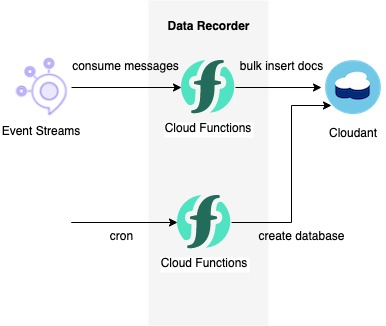

## Data Recorder
<center></center>

- The data recorder, one of the back-end functions of the COVSAFE solution, runs on IBM Cloud Function.
- The main function of the data recorder is to store edge-side sensing data in a persistent database in the cloud. The data recorder streams edge-side sensor data by consuming topics in the IBM Cloud Event Stream, and stores the updates sequentially in the cloudant database.　
    - The data recorder is triggered by a message trigger in Event Streams, gives a timestamp of the time the trigger was issued, and stores the triggered message count in bulk in the cloudant database, with one message and one document.
    - EventStream Topic: "**covsafe**"
    - Cloudant Database Name: "**z\_iotp\_o9ypqz\_default\_YYYY-MM-DD**"
        - YYYY: year, MM: Month, DD: date

## How to Install and Setup

- Run [the script](./cloud-functions/configure.sh).
  - **NOTICE: **You will need to modify the variables to fit your environment in order for the script to run.
      If you build the COVSAFE solution by runnning the scripts of delivery repository, you need not modify it.
      ```bash
      $ ./cloud-functions/config.sh
      ```

## License
- see [LICENSE](./LICENSE)
